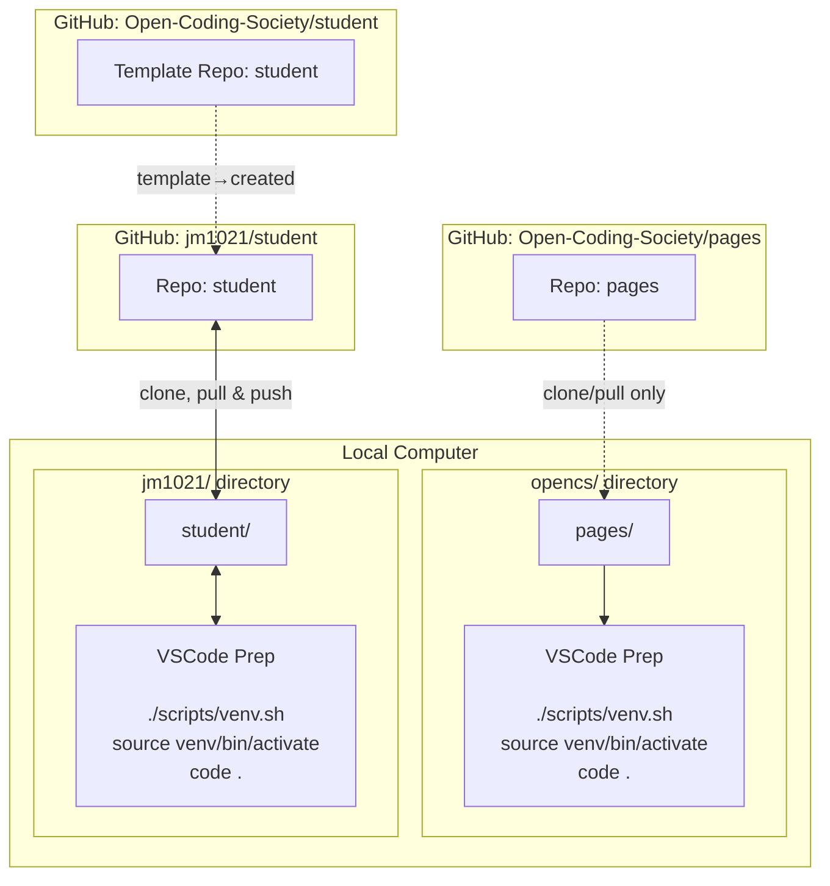

## Class Progress
I have so far setup Visual Studio Code, linked my main account into Slack, and GitHub. I was also able to setup the terminal and link it into my VS Code, so I can now edit and add things to my portfolio. I was also able to learn how to make and push edits from my VS Code, into my GitHub repository.

## Visual Journey

Linux is the most compatible OS for Developers.  

This visual help remind me of Tools and their relationship to my Development Journey. 

